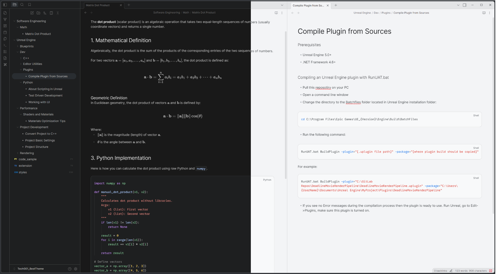
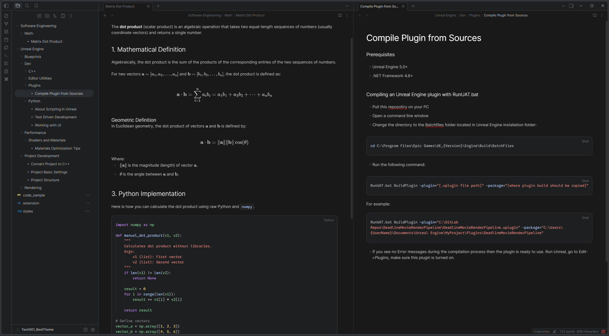

# Tech001 Theme

  
  

<h3>
  A professional, developer-focused theme for Obsidian. 
  Inspired by <b>Google AI Studio</b> and <b>Material Design 3</b>.
</h3>

---

## ✨ Overview

**Tech001** is a modern, high-contrast theme designed for developers, technical writers, and minimalists. It brings the clean, focus-driven aesthetics of Google's latest design systems into Obsidian.

Whether you are writing documentation in the **Deep Dark** mode (inspired by Gemini/AI Studio) or drafting articles in the **Clean Light** mode (inspired by Material 3), Tech001 ensures your content takes center stage.

## 🚀 Key Features

### 🎨 Design & UI
*   **Dual Personality:**
    *   🌑 **Dark Mode:** Deep gray backgrounds, pastel syntax highlighting, and "Gemini Blue" accents. Perfect for long writing sessions.
    *   ☀️ **Light Mode:** Clean white surfaces, high-contrast black headers, and Google Blue accents. Professional and crisp.

### 💻 Developer Experience
*   **Smart File Icons:** Automatically replaces generic file icons with **text badges** based on file extensions (e.g., `PY`, `JS`, `CPP`, `HTML`, `JSON`). No more guessing which file is which.
*   **VS Code Style Syntax:** Rich syntax highlighting optimized for readability in both light and dark modes.
*   **Code Block Headers:** Stylish headers for code blocks in Live Preview mode.

### 📝 Typography & Layout
*   **Notion-Style Centering:** Content is centered with a fixed width while the scrollbar stays on the far right edge.
*   **Visual Hierarchy:**
    *   **Headers** are bright/high-contrast.
    *   **Body text** is slightly muted to reduce eye strain.
    *   **Bold text** pops out clearly.
*   **Material Design Icons:** Uses refined Material Design glyphs for standard notes.

---

## 📸 Screenshots

### Dark Mode (AI Studio Style)
> Ideal for coding and late-night research.

### Light Mode (Material 3 Style)
> Perfect for drafting and reviewing.

---

## 📦 Installation

### Method 1: Obsidian Community Store (Recommended)
1.  Open **Settings** > **Appearance**.
2.  Click **Manage** next to Themes.
3.  Search for **"Tech001"**.
4.  Click **Install** and then **Use**.

### Method 2: Manual Installation
1.  Download `theme.css` and `manifest.json` from the [Releases page](https://github.com/volodinroman/obsidian-tech001-theme/releases).
2.  Go to your vault folder: `.obsidian/themes/`.
3.  Create a folder named `Tech001`.
4.  Paste the files there.
5.  Select **Tech001** in Obsidian Settings.

---

## 🔧 Recommended Settings
For the best experience, ensure the following settings are configured:

*   **Appearance > Base color scheme:** Works great in both *Dark* and *Light*.
*   **Files & Links > Show indentation guides:** `Off` (The theme handles indentation cleanly without vertical lines, but you can enable them if you prefer).
*   **Font:** The theme defaults to *Inter / Roboto*. Ensure you have a nice sans-serif font installed. For code it uses "JetBrains Mono" encoded into css, so you don't have to install it.

---

## ❤️ Support & Contributions

Found a bug? Have a suggestion?
Please [open an issue](https://github.com/volodinroman/obsidian-tech001-theme/issues) or submit a pull request!

If you like this theme, please **give it a star ⭐ on GitHub!**

---

  Created by <b>Roman Volodin</b> in 2025

